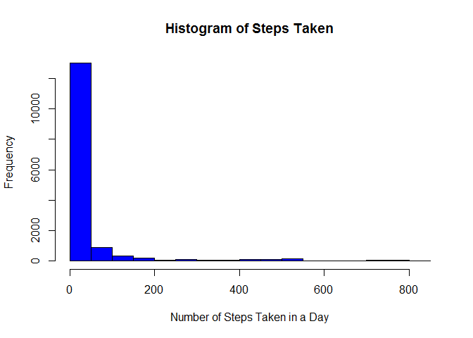
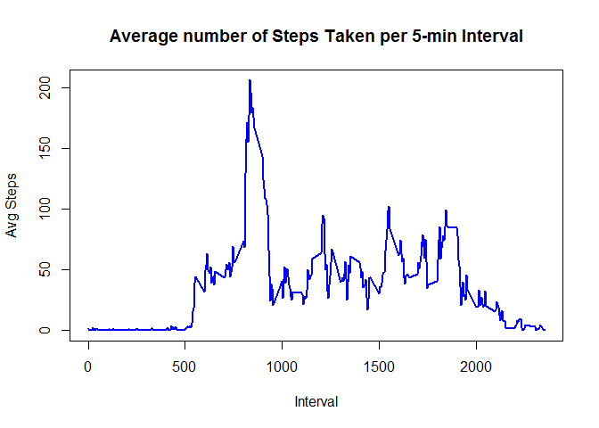
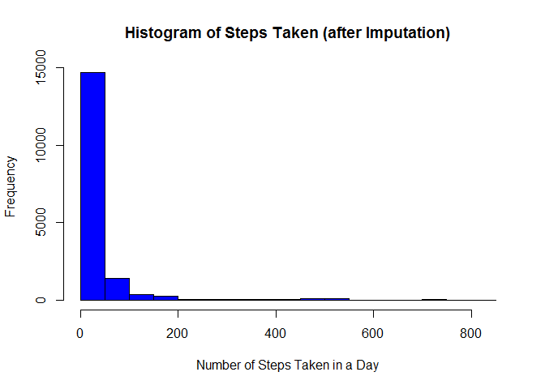
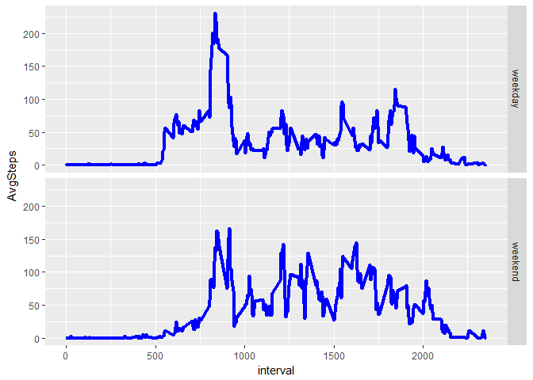

# Reproducible Research: Peer Assessment 1


In this data analysis we will analyze the activity (in steps taken) on a daily basis for two months - October through December 

## Read in the Data

First, read in the activity.csv file and clean up the "date" field by making it a date format that R recognizes.

```r
library(dplyr)
```

```
## Warning: package 'dplyr' was built under R version 3.3.2
```

```
## 
## Attaching package: 'dplyr'
```

```
## The following objects are masked from 'package:stats':
## 
##     filter, lag
```

```
## The following objects are masked from 'package:base':
## 
##     intersect, setdiff, setequal, union
```

```r
library(ggplot2)
```

```
## Warning: package 'ggplot2' was built under R version 3.3.2
```

```r
setwd('./activity')
act <- read.csv('activity.csv')
act$date <- as.Date(act$date, format = '%Y-%m-%d')
```


## What is mean total number of steps taken per day?

 1. Make a histogram of the total number of steps taken each day


```r
hist(act$steps, col = 'blue', main = 'Histogram of Steps Taken', 
     xlab = 'Number of Steps Taken in a Day')
```

<!-- -->
 
 
 2. Calculate and report the mean and median total number of steps taken per day


```r
meanSteps <- mean(act$steps, na.rm = T)
medianSteps <- median(act$steps, na.rm = T)
meanSteps
```

```
## [1] 37.3826
```

```r
medianSteps
```

```
## [1] 0
```

## What is the average daily activity pattern?
 
 1. Make a time series plot (i.e. type = "l") of the 5-minute interval (x-axis) and the average number of steps taken, averaged across all days (y-axis)
 

```r
dailyAvg <- act %>% group_by(interval) %>% summarize('AvgSteps' = mean(steps, na.rm=T))
plot(dailyAvg$interval, dailyAvg$AvgSteps, type = 'l', col = 'blue', lwd = 2, 
     main = 'Average number of Steps Taken per 5-min Interval', ylab = 'Avg Steps', xlab = 'Interval')
```

<!-- -->

 2. Which 5-minute interval, on average across all the days in the dataset, contains the maximum number of steps?

```r
maxInterval <- dailyAvg[ which.max(dailyAvg$AvgSteps), 'interval']
maxInterval
```

```
## # A tibble: 1 × 1
##   interval
##      <int>
## 1      835
```
According to the calculation and plot above, the greatest amount of activity, on average, is during 0835 - 0840 every morning.

## Imputing missing values

Note that there are a number of days/intervals where there are missing values (coded as NA). The presence of missing days may introduce bias into some calculations or summaries of the data.

 1. Calculate and report the total number of missing values in the dataset (i.e. the total number of rows with NAs)

```r
nas <- sum(is.na(act$steps))
nas
```

```
## [1] 2304
```

There are exactly `nas` in the dataset that we are analyzing.

2. Use the mean for each 5-minute interval to impute the missing values and create a new dataset that is equal to the original dataset, but with the missing data filled in.


```r
act2 <- left_join(act, dailyAvg, by = 'interval')
act2$steps <- ifelse(is.na(act2$steps), act2$AvgSteps, act2$steps)
act2 <- act2[, -4]

head(act2)
```

```
##       steps       date interval
## 1 1.7169811 2012-10-01        0
## 2 0.3396226 2012-10-01        5
## 3 0.1320755 2012-10-01       10
## 4 0.1509434 2012-10-01       15
## 5 0.0754717 2012-10-01       20
## 6 2.0943396 2012-10-01       25
```

 3. Make a histogram of the total number of steps taken each day and Calculate and report the mean and median total number of steps taken per day. Do these values differ from the estimates from the first part of the assignment? What is the impact of imputing missing data on the estimates of the total daily number of steps?


```r
hist(act2$steps,col = 'blue', main = 'Histogram of Steps Taken (after Imputation)', 
     xlab = 'Number of Steps Taken in a Day')
```

<!-- -->

```r
meanSteps2 <- mean(act2$steps, na.rm = T)
medianSteps2 <- median(act2$steps, na.rm = T)
meanSteps2
```

```
## [1] 37.3826
```

```r
medianSteps2
```

```
## [1] 0
```

The mean changed from 37.3825996 to 37.3825996 and the median changed from 0 to 0 after imputation.  There was no impact on both the mean and the median after the data was imputed.

## Are there differences in activity patterns between weekdays and weekends?

 1. Create a new factor variable in the dataset with two levels -- "weekday" and "weekend" indicating whether a given date is a weekday or weekend day.


```r
act2$day <- weekdays(act2$date, abb = T)
weekday.t <- c('Mon', 'Tue', 'Wed', 'Thu', 'Fri')
act2$wd <- ifelse(act2$day %in% weekday.t, 'weekday', 'weekend')
```
 
 2. Make a panel plot containing a time series plot (i.e. type = "l") of the 5-minute interval (x-axis) and the average number of steps taken, averaged across all weekday days or weekend days (y-axis).
 

```r
gg.data <- act2 %>% group_by(wd, interval) %>% summarize('AvgSteps' = mean(steps, na.rm = T))
gg <- ggplot(data = gg.data, aes(x = interval, y = AvgSteps)) + geom_line(lwd = 1.5, col = 'blue') + facet_grid(wd~.)
gg
```

<!-- -->

From the plot above, there appears to be a little bit less activity on the weekends in the morning but more activity in the afternoon.  From the calculation below - there is more activity, on average, during the weekends.


```r
act2 %>% group_by(wd) %>% summarize('Mean' = mean(steps, na.rm= T), 'Median' = median(steps, na.rm = T))
```

```
## # A tibble: 2 × 3
##        wd     Mean Median
##     <chr>    <dbl>  <dbl>
## 1 weekday 35.61058      0
## 2 weekend 42.36640      0
```

